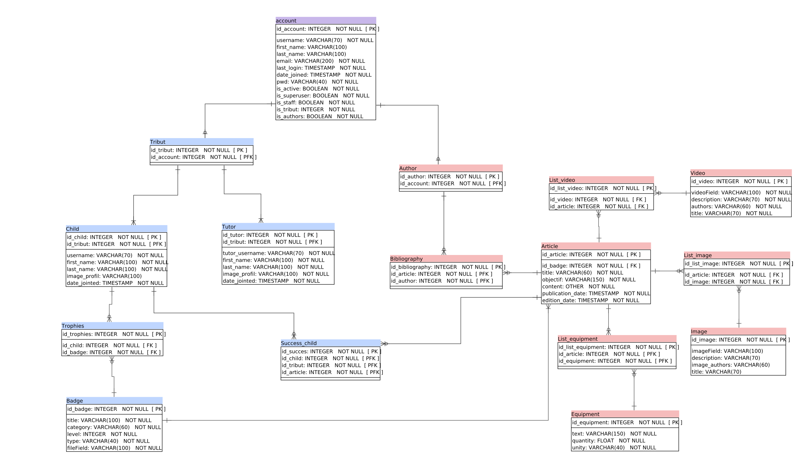

# explorateur-par-nature.express

## I - Introduction

### I-1 - Aim of the website
This website is conceived for children with the supervision of a adult guardian, for realise manual activity, 
with a pedagogical goal and mainly axes on nature. 
It allows user to create a "tribute" constitute by adult(s) guardian(s) profiles and child(s) profiles. 
After profile creation, child(s) will be able to consult article and realise activities describe in this article 
(with supervision of an adult(s) guardian(s)). 
When the activity is successfully completed, the guardian or the child will valid the activity. 
After completion of activities on the same them, with a progression, the child win a virtual badge. 
After the completion of all badge, the child win a virtual trophy.


### I-2 Licence

See licence file (code is under MIT licence, content under copyright). 

### I-3 Requirements

See requirements.txt file. 

### I-4 - Prerequisite

1. Python 3.8 installed
2. PostgreSQL 12.7 installed

### I-5 - Get started

1. Clone the project to your machine ```[git clone https://github.com/sebajou/explorateur-par-nature.fr]```
2. Navigate into the diretory ```[cd django-todo-react]```
3. Source the virtual environment ```[pipenv shell]```
4. Install the dependencies ```[pipenv install]```
5. Create database and set this database in setting.py
```CREATE DATABASE ex_par_nat_exp_db;```
```GRANT ALL PRIVILEGES ON DATABASE ex_par_nat_exp_db to user;```

### I-5 - How to run
You will need two terminals pointed to the frontend and backend directories to start the servers for this application.

1. Run this command to start the backend server in the ```[backend]``` directory: ```[python manage.py runserver]``` (You have to run this command while you are sourced into the virtual environment)

### I-6 - Website architecture
Website designs in Django - Postgres.

Website is designs with Tailwind CSS, HTML 5 (frontend), 
Django (backend, ORM) and Postgres (database): 
+ Django allow database consultation and writing, and calculation. 
+ Django manage dynamic template.

Database is divide in two sets of table: 
+ One about user (guardians and children) and their own badge and trophies, 
+ One about articles and their media. 
This database serve front through Django Rest API.
The front is divide in two part: 
+ One public part for the user (guardians, children and tributes), 
dedicated for the article consultation, for the badge and trophies attribution. 
+ One private, dedicated for authors, for article conception, with online tools for articles editing. 

## II - Database


*Database architecture*

Two group of table constitute this PostgreSQL database:
+ Tables link with users profiles and badges management. 
+ Tables link with articles and media management. 

## III - Backend

Two app constitute this Django backend: 
+ UsersApp who deal with users profiles and badges managements. 
+ ArticlesApp who deal with articles consultation and editing managements. 

## IV - Front

Front are divide in two page:
+ Users page. 
+ Authors page. 
This project use Tailwind CSS framework.
